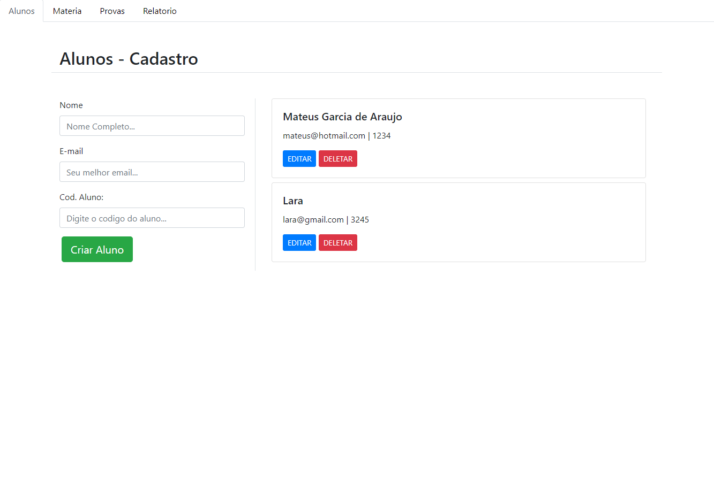

## :robot: Alunos Notas - Crud em vuejs usando a localStorage para persistir os dados

#### 	Esse sistema é feito para simular um diário de professores digital, onde se pode cadastrar Alunos, Provas e Matérias e no fim tem o relatório de todos alunos que tem provas cadastradas.

### As tecnologias usadas foram:  

- Vuejs
- Bootstrap 4 

para baixar o sistema pelo Github você vai precisar clonar o repositório:

```bash
git@github.com:mateuszao/AlunosNotass.git
```

depois do repositório clonada vai ser necessário ter o node js instalado na sua maquina para baixar os pacotes utilizados.

após instalar vai ser necessário:

``` bash
# install dependencies
npm install

# serve with hot reload at localhost:8080
npm run dev

# build for production with minification
npm run build
```

For detailed explanation on how things work, consult the [docs for vue-loader](http://vuejs.github.io/vue-loader).

Quando estiver instalado localmente. O sistema funciona de forma bem simples tem as telas de cadastro e depois tem o relatório 



e para usar é só preencher os inputs e criar o Aluno | Materia | Prova ou editar.